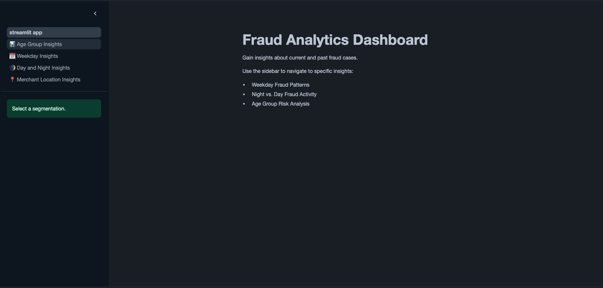
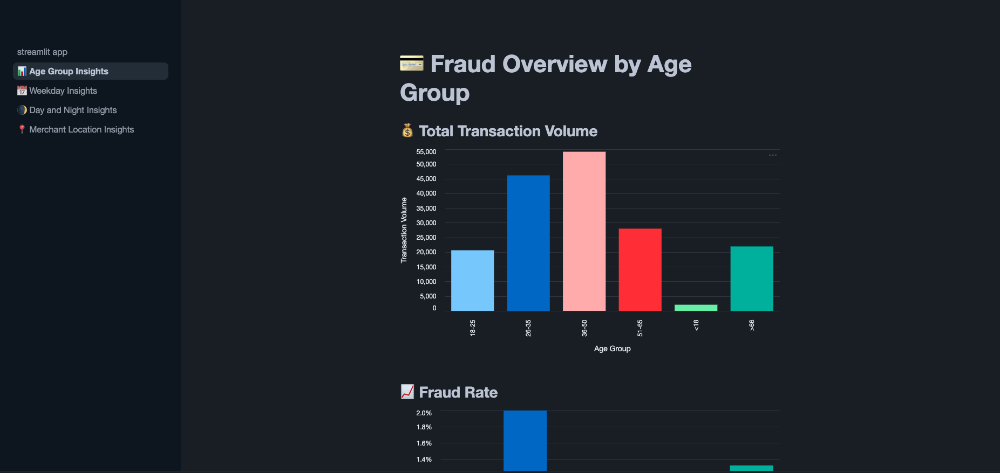
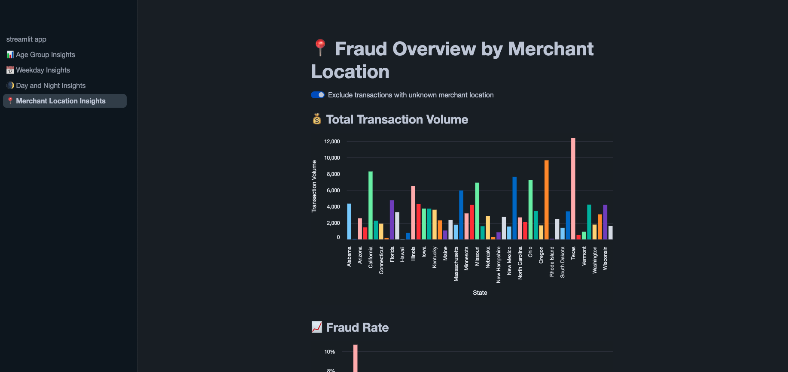
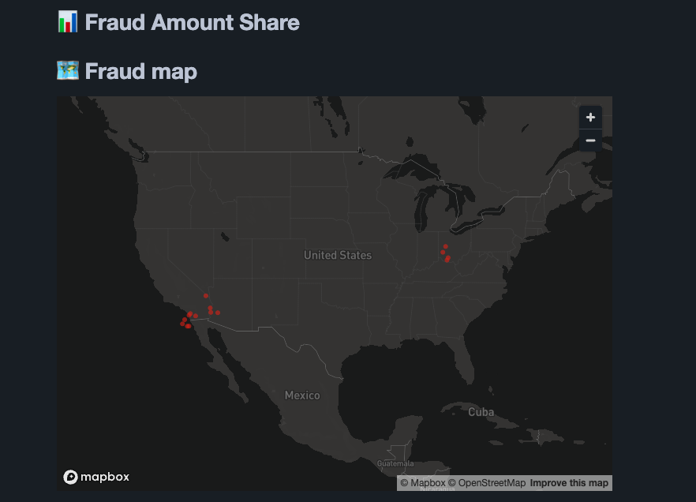

# Credit Card Transactions Visualization /w Streamlit in Snowflake (SiS)

## Idea

This repository contains a Streamlit dashboard for visualizing fraud detection insights based on credit card transaction data. The dashboard is deployed via Streamlit in Snowflake (SiS) and is part of a larger end-to-end data pipeline.

👉 For the full pipeline, see the [main project repo](https://github.com/Djirlic/fraud-detection-e2e-pipeline).

## Features & Visualizations

The dashboard answers questions such as:
- Which age group has the highest number of transactions?
- Which age group is most affected by fraud?
- On which days and times is fraud most likely?
- Which U.S. states see the highest fraud rates?
- Where are fraud cases located in the U.S.?

Visualizations include:
- Bar charts
- Pie charts
- A map with fraud case locations

> [!NOTE]  
> The following screenshots were taken after uploading data for a single day. Final visualizations based on the full dataset may show different patterns and results.

_Entry point of the Streamlit dashboard._

_Total transaction volume by age group._

_Total transaction volume by merchant location (state)._

_A map of the states with fraud cases highlighted._

## Dashboard structure

The app is organized into multiple pages:
- Age Group Insights: Transaction and fraud distribution across age brackets
- Weekday: Insights on which day of the week most transactions and fraud is happening.
- Day and Night Insights: Transactions and fraud distribution throughout the day.
- Merchant Location Insights: Information about which states have most transactions and fraud and a map of fraud cases.
